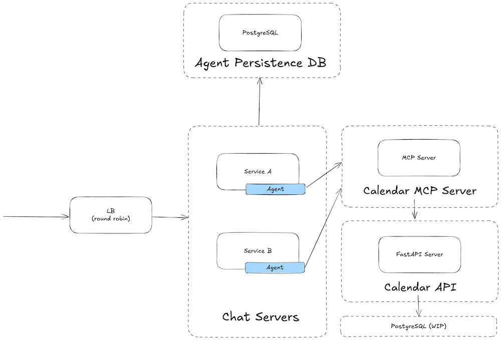

# Calendar Agent
This is a sample project that consist of microservices for a simple agentic AI to help with calendar related actions

## Table of Contents

- [Calendar Agent](#calendar-agent)
- [Microservices and Components](#microservices-and-components)
  - [Devops](#devops)
  - [Chat server (Backend)](#chat-server-backend)
  - [Calendar MCP](#calendar-mcp)
  - [Calendar API](#calendar-api)
- [How to start](#how-to-start)
- [TODO items](#todo-items)

Projects
| Service | Description |
|----------------|-------------------------------------------------|
| devops         | Reverse proxy and running all microservices with Docker |
| calendar-mcp   | MCP server for interacting with actions |
| calendar-api   | API server for calendar related queries |
| backend        | Chat servers |

## Microservices and Components
List of projects and their purpose

### Devops
This service has two purposes - to orchestrate all other microservices and network, and to manage entry point

### Chat server (Backend)
This service creates BFF (Backend to Frontend) APIs for chat related activities. It consists of following parts:
1. FastAPI service with APIs
2. ADK (Agent Development Kit) Agent
3. Postgres for chat persistance

### Calendar MCP
This service is an MCP server for Chat servers to use. It is implemented with FastAPI

### Calendar API
This service is a CRUD Calendar service. It utilizes:
1. FastAPI for CRUD actions
2. Postgres for persistence ***(Work In Progress)***

## How to start
1. Go to devops folder and copy `.env.template` file to `.env`
2. Populate `.env` file
3. Start entire project via devops by running `docker compose up` in devops folder

All the projects come with `.bru` files for easy usage and debugging with [Bruno](https://www.usebruno.com/) API Client

## TODO items
List of enhancements:
- PSQL persistence for calendar events
- Ability to detect and manage scheduling conflicts
- Circuit Breaker for all services
- More intergration and unit tests

